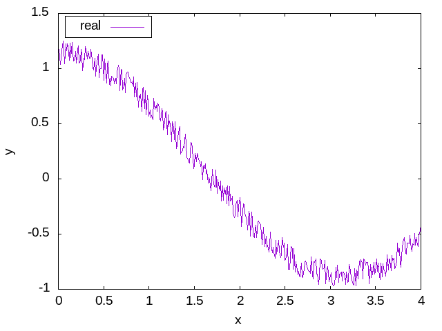
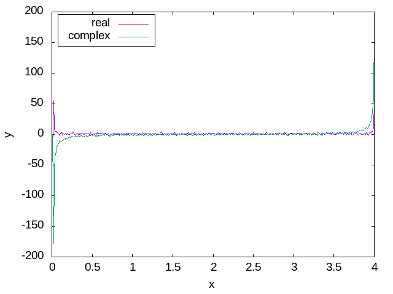
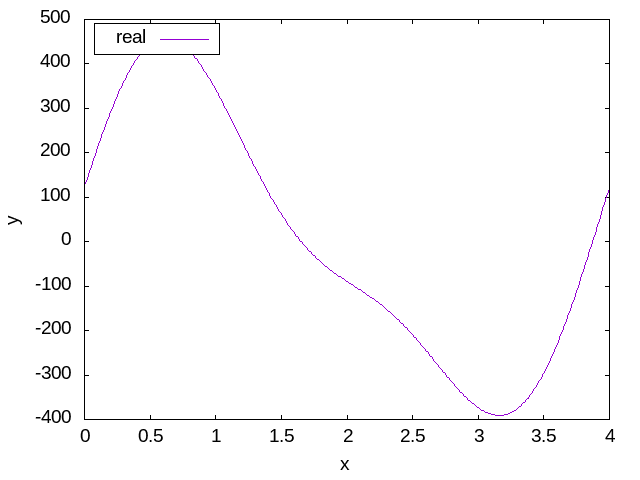

## Kompilacja 
W tym folderze:
```
make
```

## Opis projektu 

**Aby uruchomić**<br>
Zad1:
```
./transform.out
```

Zad2:
```
./noise.out
```

Kod do zadania pierwszego w całości zawiera się w pliku `src/transform.f90`.<br>
Kod do zadania drugiego w całości zawiera się w pliku `src/noise.f90`.<br>

Generowane dane do wykresów lądują w folderze `res/plotdata`.<br>
Aby wygenerować wykresy:
```
gnuplot plot.cfg
```

## Opis rozwiązań
### Zad1:

Wejściowa funkcja wygląda następująco:


Funkcja po dokonoaniu transofrmaty wygląda następująco:


Program dokonuje transformaty Fouriera na zadanej funkcji wejściowej.
To co widzimy na wynikowym wykresie, to rozkład funkcji wejściowej na składowe
funkcje harmoniczne. W niektórych miejscach można zaobserwować "skoki" wartości na wykresie. (Np. x ~= {0, 0.3, 2, 2.2 }), Oznacza to, że fale o takich częstotliwościach
maja "większe znaczenie" w konstrukcji sygnału wejściowego.

### Zad2:
Wejściowa, zaszumiona funkcja cosinus:



Funkcja po dokonaniu transformaty Fouriera:



Na powyższym wykresie widać, że w funkcji wyraźnie wybijają się dwie częstotliwości.
Ta na początku i na krańcu przedziału. Cała reszta ma mniej więcej podobne wartości.
Oznacza to, że większość interesującego nas sygnału jest zakodowana tymi dwoma
"wybiciami". Resztę sygnału można odfiltrować ze względu na wartości mniejsze od
pewnej wartości granicznej (w naszym przypadku 50).

Funkcja po odfiltrowaniu szumu i odwrotnej transformacie:



Jak widzimy na wykresie powyżej, "odcięcie" wartości poniżej 50 spowodowało
usunięcie szumu z funkcji wejściowej. Nie jest to dokładnie funkcja cosinus, ale
coś zbliżonego do niej, bez nieinteresującego nas szumu. Widać też zmianę zakresu
wartości na osi odciętych wykresu, ale to kwestia zastosowania biblioteki FFTW, która
nie normalizuje dokonowyanych transformat.

